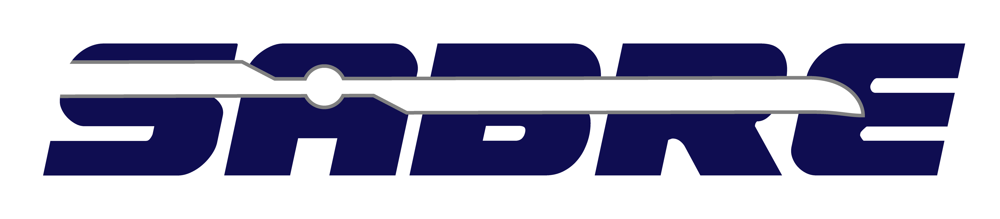

# HeliNoise

*Post-processing interface between CAMRAD II and TAU (under progress), and PSU-WOPWOP* 

This toolchain was created to use rotorcraft blade forces obtained from an aeromechanical comprehensive analysis ([CAMRAD II](http://www.camrad.com/CAMRADII.html)) and predict the corresponding rotor aeroacoustics using Ffowcs Williams-Hawkings equation-based solver ([PSU-WOPWOP](https://arc.aiaa.org/doi/10.2514/6.2007-1240)).  
In addition to the data wrangling necessary for data manipulation and generation of compliant files for analysis, this tool has the flexibility to generate structured discretization of the blade surfaces based on blade definition provided within a formatted .yml file. This is necessary because rotorcraft comprehensive analysis tools, and CAMRAD II (CII) in particular, use a 1D representation of the rotor blade for both structural and aerodynamic analysis. As a result, an external open source tool [SONATA](https://gitlab.lrz.de/HTMWTUM/SONATA) is employed to generate this discretization. 
To take complete advantage of the toolchain to analyse rotors and their acoustic emissions proprietary softwares CII and PSU-WOPWOP are required. In the absence of CII, results from other rotor aeromechanical tools can be used but the results need to be organised in a similar format (check Python pickle file [sample_CII_output_data_dict.p](sample_CII_output_data_dict.p)).

## Comments

CII solution output file contains all the relevant info to generate the deformed/undeformed shape of the elastic lifting surfaces (except chordwise cross-section data) over the entire time period. The *.yml input file provided contains the missing chordwise cross-section info provided as the blade cross-section airfoil coordinates or just the airfoil name (and the relevant coordinates are imported automatically). Additionally, some redundant info already available in the CII output file is also provided. The redundancy is due to the already existing construct in SONATA.  

## Installation

**[Detailed Prerequisites and Installation Instructions](docs/installation.md)**

## Usage

* **[CII](CII)** contains scripts for handling CII runs and wrangling output results.
* **[FishBAConator](FishBAConator)** contains scripts that can be used for generating airfoil profiles with varying camber deflections based on the [FishBAC](https://www.researchgate.net/profile/Benjamin_Woods/publication/267508835_Aerodynamic_Modelling_of_the_Fish_Bone_Active_Camber_Morphing_Concept/links/57028d4208ae646a9da873fb/Aerodynamic-Modelling-of-the-Fish-Bone-Active-Camber-Morphing-Concept.pdf) morphing concept. These were developed by [Amine Abdelmoula](https://www.lrg.tum.de/en/ht/staff/amine-abdelmoula-msc/) and Masters student Fabian Grimm at TUM. **[sabre_morphing.py](FishBAConator/sabre_morphing.py)** was separately added for seamless communication with the rest of the HeliNoise construct.
* **[plot](plot)** contains all plotting routines employed to generate plots [here](https://www.researchgate.net/publication/348245919_Effect_of_Active_Camber_on_Rotor_Noise_Power_and_Hub_Vibration)
* **[PSU_WOPWOP](PSU_WOPWOP)** contains scipts for generating and verification of PSU_WOPWOP input files. 
* **[SONATA](SONATA)** contains the relevant code within HeliNoise for communicating with the general multidisciplinary optimization toolbox [SONATA](https://gitlab.lrz.de/HTMWTUM/SONATA)
* **[TecPlot](TecPlot)** contains scripts that utilise pytecplot installation to generate `*.plt` files of the blade surface deformation or view acoustic output results from PSU-WOPWOP within TecPlot. 

## Under development
Addition of functionality to process and analyse coaxial rotors is in-progress. Additionally, modules to analyse CFD analysis output from TAU are under-development.  

## Publications:

**Kumar, S., Komp, D., Hajek, M., Rauleder, J.:** [Effect of Active Camber on Rotor Noise, Power and Hub Vibration, AIAA SciTech Forum, Virtual Event, 2021](https://www.researchgate.net/publication/348245919_Effect_of_Active_Camber_on_Rotor_Noise_Power_and_Hub_Vibration)

## Acknowledgment:
This work was carried out within the scope of the EU-funded Horizon 2020 project SABRE (grant agreement no. 723491).  

